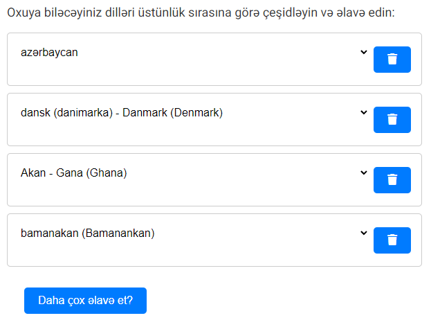

# Languages app

The application is a simple website that allows a user to select one or more languages, order them by preference, and have the website be displayed in the top most selected language.

## Frontend UI

- The site has text at the top to describe the purpose of the site. This text is translated to the currently selected language and is gotten from the `translations` object in local storage. The key for the text value is `SortLanguagesPrompt`.

- Below the description, there is a list of languages that the user has chosen. The languages are displayed in the language of the currently selected language (the language at the top).

- The list consists of cards, where each card has the language written to the left, and a delete button to the right. Each has a dropdown arrow in the middle (right aligned) which allows the user to change the localized version of the language. The dropdown is populated with the locales of the language, and the language is changed when a locale is selected.

- The list is a drag and drop, where the user can drag and drop the languages to change the order. The order is saved in local storage, and is used to determine the order of the languages (read ahead for implementation).

- There is a button at the bottom of the list that allows the user to add more languages to the list. It's text is specified by the currently selected language (read ahead for language implementation), the text is gotten from the `translations` object in local storage, with the key for the text value being `ChoosePreferredLanguagesPrompt`. This button spawns a modal (dialog) that allows the user to search for languages and add them to the list.

### "Add language" modal

- The modal has a search bar at the top that allows the user to search for languages. The search is done in real time, and filters the languages based on the input. The search is case insensitive.

- Next to the search bar, there is a button with an X that closes the modal.

- Below the search bar, there is a list of languages that can be selected. Each language has a checkbox to the left of it, and the language name to the right. The language name is in the language of the currently selected (top most) language (read ahead for translations implementation).

- Below, the list to the left, there is a duplicate search bar, which is synced with the one above.

- To the bottom right, the modal has a button to add the selected languages to the list of chosen languages. This button is not shown if no languages are selected.

- The button has the text **"Add \<language\>"** and then if several are selected, it will comma sepperate them like this **"Add \<language\>, \<language\>, \<language\>"** and so on. The **"Add"** is always in english, and the language names are in the language of the currently selected (top most) language.

## Frontend functionality

- On load, all the languages available are fetched from the `/allLanguages/<code>` endpoint, and are stored in an array in memory. See the [backend section](#backend) for more information on the endpoint.

- The current settings of the selected languages are stored in local storage to persist in sessions / tabs. This is represented with the key `deviceSettings` that has the JSON formatted language codes. This object is represented like so:

  ```
  {
    "languages" : [
      <language code string>
    ]
  }
  ```

  When adding several chosen languages, this is the array that is appended to, to represent state accross tabs. This is also the array that dictates the order of the languages. So when the page loads, it checks if this array is in local storage, and if it is, it uses this array to populate the list of chosen languages. If it is not, it uses danish as the default language, and sets the array to `["da"]`.

- The delete button on each card removes the language from the list, and updates the local storage array.

- The language specific translations of the sites text, such as the initial description and the add button is recieved from the `/translations/<code>` endpoint, and stored in local storage. This is set with the key `translations` with the JSON value of:

  ```
  {
    "SortLanguagesPrompt" : <description text string>,
    "ChoosePreferredLanguagesPrompt" : <add button text string>,
    "NextButtonText" : <next button text string> (unused?)
  }
  ```

- To keep state the same accross tabs, the site needs to listen to the local storage changes, thus it must implement a listener on `StorageEvent` to check for changes, and reload with the new settings. This listener listens for changes to the `deviceSettings` object and updates on changes.

- Upon changing the specific local language (using the dropdown on a specific language), no matter the language and position in the list of chosen languages, a request is made to `/translations/<code>` for the currently selected (top most) language to update descriptions.

- If a change is made to the local language (using the dropdown) of the language that is at the top, then both a request to `/translations/<code>` and `/allLanguages/<code>` is made to update the language of the site.

- When a language is set as the first (top), a request is again sent to both previous endpoints with the new language code, and the text of the site and languages are updated, just as previously described. See pictures below, where the top 2 languages are switched. Notice how both the site text changes, and the names of the languages are changed to represent the new top language.




- Upon lcosing the modal, a request is made to `/translations/<code>` to update the site with the current top language.

## Backend

### Endpoints

- The `/allLanguages/<code>` GET endpoint returns a list of all languages, translated into the specified language. It has the `isSelected` field in each language be false, except for the specified language, which is true. A shortened list of the returned languages by a `/allLanguages/da` request would look like this:

  ```
  {
    "cy": {
      "isSelected": false,
      "languageIsoCodesWithLocales": {
        "cy": "Cymraeg (walisisk)",
        "cy-GB": "Cymraeg (walisisk) - Y Deyrnas Unedig (United Kingdom)"
      }
    },
    "da": {
      "isSelected": true,
      "languageIsoCodesWithLocales": {
        "da": "dansk",
        "da-DK": "dansk - Danmark (Denmark)",
        "da-GL": "dansk - Grønland (Greenland)"
      }
    },
    "dav": {
      "isSelected": false,
      "languageIsoCodesWithLocales": {
        "dav": "Kitaita (taita)",
        "dav-KE": "Kitaita (taita) - Kenya"
      }
    }
  }
  ```

  _Notice how the `languageIsoCodesWithLocales` object has the language code as the key, and the language name as the value. This is used to display the language locales in the dropdown on each language._

  - Language codes are in the format of `ISO 639-1` and `ISO 3166-1 alpha-2` combined with a hyphen, like `da-DK` for danish in Denmark.
  - They are grouped by language code prefix, to determine which are main languages, and which are locales.

- The `/translations/<code>` GET endpoint returns the translations of the site text in the specified language. The response is a JSON object with the keys `SortLanguagesPrompt`, `ChoosePreferredLanguagesPrompt`, and `NextButtonText` with the corresponding text in the specified language. An example response would look like this:

  ```
  {
    "SortLanguagesPrompt": "Vælg dine foretrukne sprog",
    "ChoosePreferredLanguagesPrompt": "Tilføj sprog",
    "NextButtonText": "Næste"
  }
  ```

  If no translations are found, the response is filled with the key as the value, like this:

  ```
  {
    "SortLanguagesPrompt": "SortLanguagesPrompt",
    "ChoosePreferredLanguagesPrompt": "ChoosePreferredLanguagesPrompt",
    "NextButtonText": "NextButtonText"
  }
  ```

### Storage

- The storage solution could be both SQL or NoSQL, but for simplicity, I would suggest a NoSQL solution like MongoDB.

- I'd suggest a schema for possibly faster sequentual memory reads, if changes are not going to be made often, where one could store the translations in NoSQL but with each object being language specific, so an `/allLanguages/da` request would go to the `da` object, and then that object has all the other languages in it, in danish. This effectively pseudo caches each response, and only needs to format it to the correct JSON format with the `isSelected` field set to true for the specified language.

- Then for a locale specific request, one takes the prefix of the language code, and gets the object with that prefix, and then gets the locale from that object. This would be faster than having to go through all the languages and locales to find the correct one.

- The `languages` collection would have the following pseudo schema:

  ```
  "<language code>": {    // The language code of the language the object represents.
    "<language code>": {  // The language codes for each language
      "isSelected": false,
      "languageIsoCodesWithLocales": {
        <language code>: <language name and locale>,
        ...
      }
    },
    ...
  },
  ...
  ```

- An example entry in the database would look like this:

  ```
  "da": {
    "cy": {
      "isSelected": false,
      "languageIsoCodesWithLocales": {
        "cy": "Cymraeg (walisisk)",
        "cy-GB": "Cymraeg (walisisk) - Y Deyrnas Unedig (United Kingdom)"
      }
    },
    "da": {
      "isSelected": true,
      "languageIsoCodesWithLocales": {
        "da": "dansk",
        "da-DK": "dansk - Danmark (Denmark)",
        "da-GL": "dansk - Grønland (Greenland)"
      }
    },
    "dav": {
      "isSelected": false,
      "languageIsoCodesWithLocales": {
        "dav": "Kitaita (taita)",
        "dav-KE": "Kitaita (taita) - Kenya"
      }
    },
    ...
  },
  ...

  ```

- The `translations` collection would have the following schema:

  ```
  "<language code>": {
    "translations": {
      "SortLanguagesPrompt": <string>,
      "ChoosePreferredLanguagesPrompt": <string>,
      "NextButtonText": <string>
    }
  }
  ```

### Possible improvements

- Another approach that might be more flexible, would be to have a `languages` collection, where each document represents a language, and has it's own language and locale represented in each other language. it would look like so:

  ```
  "<language code>": {        // The language code of this language
    "languageName": <string>, // The name of the language in their own language
    "localeName": <string>,   // The name of the locale in their own language and english version in parentheses
    "languageNames": [        // An array of language names in different languages
      {
        "languageCode": <string>,
        "languageName": <string> // The name of the outer object's language in the specified language
      },
      ...
    ]
  },
  ...
  ```

- An example document in the `languages` collection would look like this:

  ```
  "da": {
    "languageName": "dansk",
    "localeName": "Danmark (Denmark)",
    "languageNames": [
      {
        "languageCode": "da",
        "languageName": "dansk"
      },
      {
        "languageCode": "en",
        "languageName": "Danish"
      },
      ...
    ]
  },
  ...
  ```

- This would mean that for every request, every object has to be read, but it would be more flexible, and allow for more languages to be added without having to change the much. But would require some more string building.

- One could also do an SQL database for these, with all the language specifics in each row of a table, with a seperate giant table of all the languages and their translations, which would then have to be joined and constructed into the JSON object that is returned.
